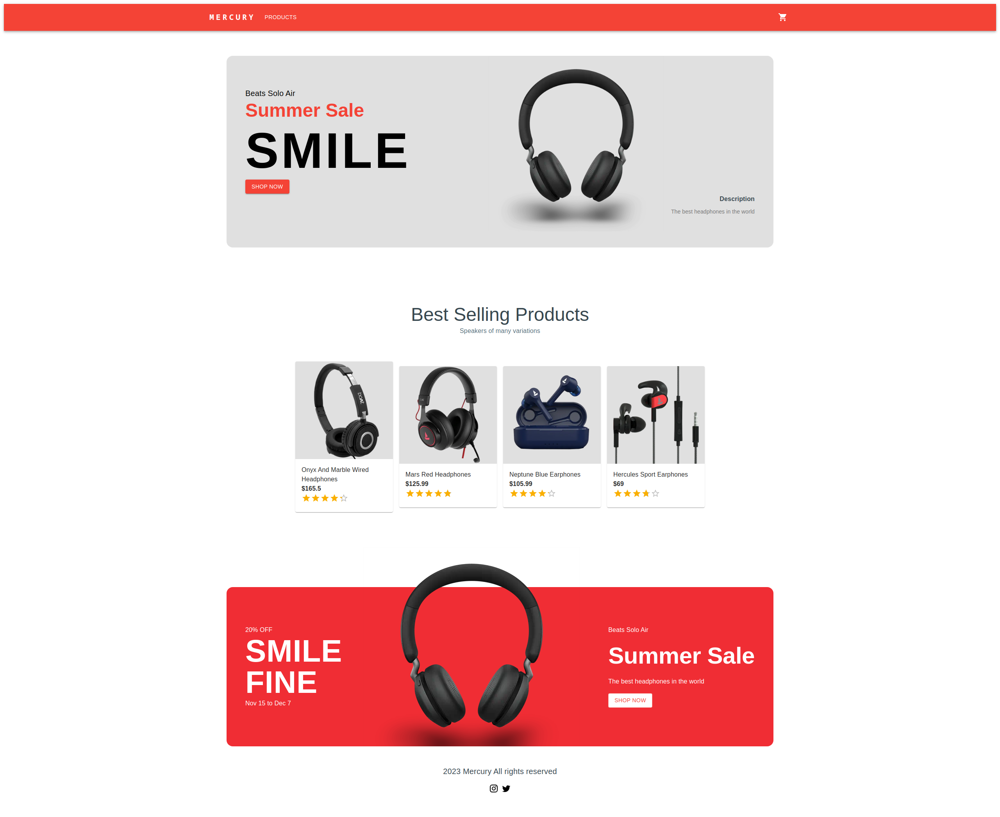

<a name="readme-top"></a>
<div align="center">

[![Contributors][contributors-shield]][contributors-url]
[![Forks][forks-shield]][forks-url]
[![Stargazers][stars-shield]][stars-url]
[![Issues][issues-shield]][issues-url]
[![MIT License][license-shield]][license-url]
[![LinkedIn][linkedin-shield]][linkedin-url]

  <p align="center">
    <h1>Mercury</h1>
  <p>
    A simple eCommerce website
  </p>
    <a href="https://mercury-indol.vercel.app">View Demo</a>
  </p>
</div>

<details>
  <summary>Table of Contents</summary>
  <ol>
    <li>
      <a href="#about-the-project">About The Project</a>
      <ul>
        <li><a href="#built-with">Built With</a></li>
      </ul>
    </li>
    <li> <a href="#getting-started">Getting Started</a></li>
    <li><a href="#license">License</a></li>
    <li><a href="#contact">Contact</a></li>
  </ol>
</details>
<br>

## About The Project

<div align="center">
  
</div>
<br>

### Built With

* [![Next][Next.js]][Next-url]
* [Stripe](https://stripe.com)
* [Sanity CMS](https://www.sanity.io)
* [Material UI](https://mui.com)


## Getting Started

Clone the project

```bash
  git clone https://github.com/kirontoo/mercury
```

Go to the project directory

```bash
  cd mercury
```

Install dependencies

```bash
  npm install
```

Start the server

```bash
  npm run start
```


## License

Distributed under the MIT License. See `LICENSE` for more information.

<p align="right">(<a href="#readme-top">back to top</a>)</p>

## Contact

- Github [@kirontoo](https://www.github.com/kirontoo) 
- [![LinkedIn][linkedin-shield]][linkedin-url]

<p align="right">(<a href="#readme-top">back to top</a>)</p>


[contributors-shield]: https://img.shields.io/github/contributors/kirontoo/mercury.svg?style=for-the-badge
[contributors-url]: https://github.com/kirontoo/mercury/graphs/contributors
[forks-shield]: https://img.shields.io/github/forks/kirontoo/mercury.svg?style=for-the-badge
[forks-url]: https://github.com/kirontoo/mercury/network/members
[stars-shield]: https://img.shields.io/github/stars/kirontoo/mercury.svg?style=for-the-badge
[stars-url]: https://github.com/kirontoo/mercury/stargazers
[issues-shield]: https://img.shields.io/github/issues/kirontoo/mercury.svg?style=for-the-badge
[issues-url]: https://github.com/kirontoo/mercury/issues
[license-shield]: https://img.shields.io/github/license/kirontoo/mercury.svg?style=for-the-badge
[license-url]: https://github.com/kirontoo/mercury/blob/master/LICENSE.txt
[linkedin-shield]: https://img.shields.io/badge/-LinkedIn-black.svg?style=for-the-badge&logo=linkedin&colorB=555
[linkedin-url]: https://linkedin.com/in/amy-nguyen-dang
[product-screenshot]: images/screenshot.png
[Next.js]: https://img.shields.io/badge/next.js-000000?style=for-the-badge&logo=nextdotjs&logoColor=white
[Next-url]: https://nextjs.org/
[React.js]: https://img.shields.io/badge/React-20232A?style=for-the-badge&logo=react&logoColor=61DAFB
[React-url]: https://reactjs.org/
[Vue.js]: https://img.shields.io/badge/Vue.js-35495E?style=for-the-badge&logo=vuedotjs&logoColor=4FC08D
[Vue-url]: https://vuejs.org/
[Angular.io]: https://img.shields.io/badge/Angular-DD0031?style=for-the-badge&logo=angular&logoColor=white
[Angular-url]: https://angular.io/
[Svelte.dev]: https://img.shields.io/badge/Svelte-4A4A55?style=for-the-badge&logo=svelte&logoColor=FF3E00
[Svelte-url]: https://svelte.dev/
[Laravel.com]: https://img.shields.io/badge/Laravel-FF2D20?style=for-the-badge&logo=laravel&logoColor=white
[Laravel-url]: https://laravel.com
[Bootstrap.com]: https://img.shields.io/badge/Bootstrap-563D7C?style=for-the-badge&logo=bootstrap&logoColor=white
[Bootstrap-url]: https://getbootstrap.com
[JQuery.com]: https://img.shields.io/badge/jQuery-0769AD?style=for-the-badge&logo=jquery&logoColor=white
[JQuery-url]: https://jquery.com 